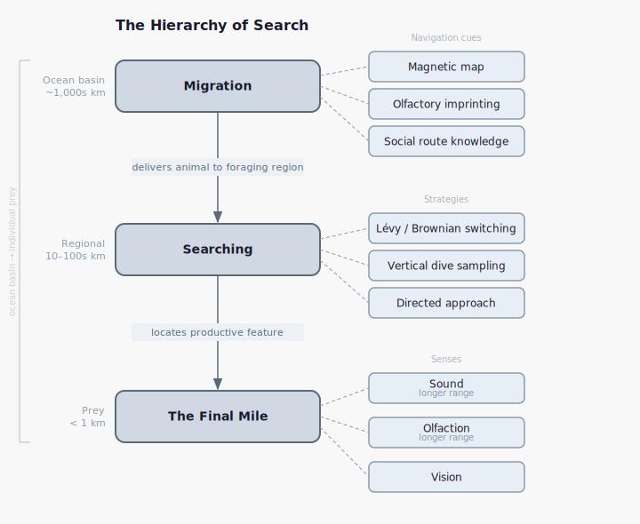

# Searching the Seas - Finding Prey as a Highly Migratory Species

## Abstract

The open ocean is one of the most challenging environments in which to find food: prey is sparse, patchily distributed, and concentrated at ephemeral features governed by ocean physics. At the top of this food web sit a set of highly migratory species (HMS) — billfish, tunas, and pelagic sharks — that must solve this search problem across entire ocean basins.

We synthesize HMS prey-finding across three hierarchical levels — basin-scale migration, regional search, and final-mile sensory targeting — alongside the methodological traditions that assembled this picture. The picture that emerges has direct practical stakes, from the demographic erosion of socially held route knowledge to climate-disrupted oceanographic cues and pollution-impaired sensory systems. Yet the picture remains a collage, assembled from studies of different species at different scales leaving synthesis within a single species an open opportunity.

## Introduction

The pelagic environment — the open ocean's entire water column — is the largest habitat on Earth. The oceans cover 71% of Earth's surface, but unlike terrestrial habitats, the pelagic extends in three dimensions with an average depth of around 3,800 meters (Lalli, 2006). That vertical extent transforms the ocean's already vast footprint into a volume of habitable space roughly 300 times greater than all land and freshwater combined (Lalli, 2006). For a sense of scale: the continental shelves — the coastal fringes that border the world's landmasses — represent just 8% of the total ocean surface, yet their total area is roughly equal to that of Europe and South America combined (Lalli, 2006). The open ocean beyond those shelves is enormous.

Like all habitats, the pelagic sustains a food web, and at its foundation sit the plankton — organisms too small or too weak to swim against the currents. At the very base are the phytoplankton — microscopic algae ranging from tens of micrometers to millimeters — which harvest light and dissolved nutrients to produce the organic matter upon which everything else depends (Lalli, 2006). Feeding on them, and on each other, are the zooplankton: animals that cannot photosynthesize and must consume to survive. Copepods, typically just millimeters long, dominate plankton net samples (Lalli, 2006), but the zooplankton also include pelagic snails, salps, and jellyfish (Lalli, 2006). What unites this unlikely assemblage is not taxonomy but trajectory: they go where the ocean takes them.

As drifters, phytoplankton depend on the ocean to provide the conditions for two things: nutrients and light. For photosynthesis to sustain a population, cells must be held within the illuminated surface layer long enough for production to outpace metabolic loss (Lalli, 2006). At the same time, nutrients must be present: either mixed upward from depth by ocean circulation, or delivered from outside the system entirely — via rivers, dust falls, or other terrestrial inputs (Behrenfeld, 2014). These two requirements set the conditions for productivity, but the planet satisfies them unevenly, in some places and at some times, but never everywhere at once.

A diverse array of physical and oceanographic processes can set up these conditions. Wind-driven upwelling along some coastlines draws cold, nutrient-rich water from depth as surface currents are pushed offshore, replacing them with water that carries the raw materials of productivity (Acha, 2015). At the boundaries between different water masses — tidal fronts, upwelling fronts, plume fronts — the collision of currents generates intense vertical circulation that concentrates nutrients and the organisms that depend on them (Acha, 2015). Further offshore, mesoscale eddies — rotating bodies of water spanning 10 to 100 kilometers and persisting for weeks to years — trap and transport enormous volumes of water across ocean basins, driving vertical fluxes of heat and nutrients that can modulate primary production at regional scales (Arostegui, 2022). The seafloor itself contributes: where currents interact with islands, shelf breaks, and irregular coastlines, nutrients are mixed into the sunlit layer from below (Acha, 2015). And from above, glacial meltwater, river discharge, and settling dust each carry nutrients into the ocean from the continents (Acha, 2015; Behrenfeld, 2014). But nutrient delivery is only half the equation: other forces must come into play to establish the stratification that limits how deeply phytoplankton are mixed (Acha, 2015).

These processes are highly dynamic — varying by season, geography, and timescale — making the productive environment heterogeneous and ever-changing. As Behrenfeld (2014) noted, "on the basis of global areal extent, phytoplankton blooms are uncommon." Productivity, when it occurs, is concentrated — and those concentrations are often ephemeral.

In addition to this patchiness comes yet another dimension of variability - the daily vertical migration (DVM). Many species of both plankton and nekton (species more capable of movement) retreat to depth during the day and surface only at night to feed (Bar-On, 2019). Darkness offers refuge from visual predators and so prey ends up distributed across hundreds of meters of water column, on a cycle governed by ambient light. This migration is performed by a biomass of staggering scale: shrimp, copepods, and krill together are estimated to constitute well over a gigatonne of animal matter worldwide (Bar-On, 2019).

At the top of this food web sit a set of highly migratory species (HMS) - including billfish, tunas, and pelagic sharks — that range across entire ocean basins. For these predators, finding food requires adaptability to a complex, ever-shifting environment — a suite of behavioral responses to a world that never sits still. Vision is sharply curtailed: in clear water, just 0.003% of surface light reaches 300 meters, leaving most of the water column dark (Fritsches, 2003). The prey that does exist is sparse: a relatively common species like the pelagic shrimp may occur at densities of only one individual per 200 to 2,000 cubic meters of water (Lalli, 2006). And that prey is not passive — it is either drifting in patches that form and dissolve on timescales set by ocean dynamics, executing a daily retreat into the dark, or both. To hunt in this environment is to solve a search problem of unusual difficulty.

This paper synthesizes what is known about prey-finding for these species. It looks across three levels — migration, searching, and the final approach — to build a coherent picture that spans ocean basin to stomach. We begin by reviewing the mechanisms operating at each level and then trace the methodologies that made that understanding possible. From there, we consider what this body of knowledge means for the conservation and management of HMS. Finally, we identify the questions that remain open, and in doing so arrive at an opportunity the literature has yet to fully exploit: integrating all three levels of prey-finding within a single species, from basin-scale movement to the moment of capture. Pursuing that integration, we suggest, is one of the discipline's most promising avenues.

## How Highly Migratory Species Find Food

*Figure 1: The three levels at which HMS solve the prey-finding problem — migration, regional searching, and final-mile sensory targeting — nest within one another across orders of magnitude of spatial scale. Each level delivers the animal to the next problem: basin-scale navigation brings it to a foraging region; search strategies and oceanographic features narrow it to a productive patch; a sequential deployment of sound, olfaction, and vision closes the final distance to individual prey.*

### Migration

At the largest scale, HMS are, by definition, migratory animals — capable of crossing entire ocean basins between the foraging grounds and spawning areas that define their life cycle. A few examples are sufficient to provide a sense of the scale involved. One whale shark named "Rio Lady" sprinted 7,213 km in 150 days, crossing the equator from the Yucatan Peninsula to the Mid-Atlantic Ridge (Hueter, 2013). Another fish, this time a 261 kg blue marlin, maintained a displacement speed of 73.8 km per day to cover 8,853 km from Puerto Rico to the coast of Angola (Andrzejaczek, 2023). In the Indian Ocean, a southern bluefin tuna was tracked for over four years, covering a cumulative total of 111,883 km (Patterson, 2018). Yet migration is not a continuous process. Some yellowfin tuna, for example, remain within 70 km of specific seamounts like Cardno and Bonaparte for over 100 days to forage before moving on (Wright, 2021).

Migration is an adaptation to spatiotemporal variation in the pelagic environment: because for some species the conditions that best support foraging, spawning, and seasonal survival are not co-located. For example, there is often tension between foraging and spawning requirements, whose ideal conditions are often in direct conflict (Relano, 2022). When marine predators are in a foraging phase, they target high-energy oceanographic features that aggregate prey biomass; yet many large pelagic species, particularly tunas, actively seek out oligotrophic, nutrient-poor waters for spawning — environments antithetical to productive feeding (Relano, 2022). Growth creates its own pressures: juvenile southern bluefin tuna undergo large-scale cyclic migrations to identify abundant food sources and maximize their rapid growth phase (Shaw, 2016). Beyond this, seasonal conditions can also force movement, with refuge migrations taking animals away from a primary habitat toward areas offering temporary shelter from unfavorable conditions (Shaw, 2016). Migration has accordingly been defined as "an adaptive response to spatiotemporal variation in resources that requires individuals to detect and respond to long-range and noisy environmental gradients" (Shaw, 2016). That is, migration is the mechanism by which animals extract value from a heterogeneous ocean that no single location can provide year-round.

Sustaining migrations of this scale requires navigational machinery that is not yet fully understood. Research has identified at least three navigational systems at work in large pelagic species: sensitivity to Earth's magnetic field, olfactory imprinting, and socially transmitted route knowledge. These systems are not mutually exclusive, and it may be that they operate in concert — each resolving a different aspect of the navigational problem.

Evidence from lab experiments and open-ocean tracking suggests that many pelagic species use Earth's magnetic field as a positional map, allowing them to detect where they are and navigate toward a distant destination. Bonnethead sharks demonstrate this capacity directly: when exposed in the laboratory to a magnetic field replicating the signature of a location 600 km south of their capture site, they oriented northward — effectively attempting to compensate for the perceived displacement (Keller, 2021). This is corroborated by open ocean tracking which revealed striking associations between wild shark swimming trajectories and local magnetic maxima and minima (Keller, 2021). The magnetic field, in this framework, functions not merely as a compass but as a map — providing animals with positional information they can use to correct their heading across open water.

Smell provides another opportunity to build a map. The clearest evidence comes from salmonids, which identify their home spawning rivers from dozens or hundreds of kilometers away by detecting the unique odor combinations they imprinted on as juveniles during smoltification (Kasumyan, 2004). Field studies in which juvenile salmonids are transplanted and released elsewhere support this picture with adults frequently returning to the release site rather than their original rearing site (Bett, 2016). The Sequential Imprinting Hypothesis extends this logic further: rather than imprinting only on natal water, juvenile fish may also encode a series of waypoints encountered along their initial downstream migration, building a chemical route map they can traverse in reverse as adults (Bett, 2016). Olfactory cues may also serve navigational purposes beyond homing: spike dives observed in yellowfin tuna have been interpreted as attempts to sample the water column for chemical orientation information (Horton, 2025).

A positional map, however, only tells an animal where it is — not where to go; converting a map into a route requires a separate layer of directional knowledge, and how animals acquire this remains an open question.

One intriguing hypothesis is that navigational knowledge can be transmitted socially. For example, Atlantic bluefin tuna abruptly disappeared from the Norwegian Sea after older individuals were largely removed from the population by fishing, followed by a sudden collapse of a traditional migratory route (De Luca, 2014). This pattern reflects a broader dynamic: groups may often consist of a small proportion of informed leaders who acquire directional information from the environment, while the majority follow (Guttal, 2010), making the collective's navigational capacity only as robust as its most experienced members. Social cues from conspecifics can also substitute for imprinted waypoints: fish transported past key waypoints as juveniles, and therefore unable to imprint on them, were later found to rely on pheromones to locate suitable spawning grounds (Bett, 2016). Navigation, in these cases, is not a fixed individual capacity but a social one — held distributed across a population and vulnerable to disruption.

While there is still much to be learned about how migrations are accomplished their eventual result for prey search is clear - to bring animals within range of foraging grounds. However, arrival is not the same as finding food, and locating prey within a region is a different problem entirely.

### Searching

At the level of a region the problem becomes one of finding the right features. As such, understanding the strategies requires understanding the features HMS are likely looking for.

Mesoscale eddies are among the most productive foraging grounds in the open ocean and fish use these rotating bodies of water 10–100 km wide as structured foraging grounds (Arostegui, 2022). Spin direction seems to matter as diverse predators, including bigeye tuna, blue marlin, and striped marlin, show a significant preference for the cores of anticyclonic eddies (ACEs), where catch rates are consistently higher than in surrounding waters (Arostegui, 2022). However, this preference is not universal across all species (Arostegui, 2022). The structural basis of this productivity lies in the eddies' thermal properties: ACEs feature anomalously warm water at depth, which displaces isotherms downward (Arostegui, 2022; Braun, 2019) and for ectothermic predators like blue sharks, this warm core acts as a "conduit" — overcoming the physiological thermal constraints that would otherwise limit access to the massive biomass of the mesopelagic twilight zone at 200–1,000 m depth (Braun, 2019). The eddy is thus not merely an incidental concentration mechanism but a physical structure that extends predators' vertical reach.

Likewise, temperature fronts concentrate prey and predators alike. Airborne lidar surveys have shown that both fish schools and solitary predators are located significantly closer to sea surface temperature (SST) fronts than would be expected by chance (Reese, 2011). Evidence suggests that schooling fish can detect slight changes in thermal gradients and actively select to associate with them (Reese, 2011). Predators follow suit: blue sharks intensify their foraging activity in high-chlorophyll frontal areas, reducing their diving depth and increasing vertical transit rates to remain within productive layers (Queiroz, 2017). The front thus functions as a shared attractor — drawing both prey and predator toward the same narrow band of water.

Seamounts offer a more persistent focal point — fixed structures to which some predators return repeatedly, long after eddies have dissipated and fronts have shifted. This has been seen with some yellowfin tuna that exhibit surprising site fidelity, remaining within 70 km of specific seamounts such as Cardno and Bonaparte for over 100 days to forage (Wright, 2021).

Not all concentrating features are defined through oceanography: the deep scattering layer — a dense band of mesopelagic organisms that migrates vertically with the light cycle — offers a massive, mobile prey resource that many predators track daily. Rather than searching the entire water column at random, evidence suggests that visual hunters time their own vertical migrations to intersect with this resource: diving deeper during the day and returning to surface waters at night to synchronize their movements with the concentration of mesopelagic prey (Andrzejaczek, 2023). But exploiting this predictability requires first finding the layer — a problem that demands its own solution.

These then are the features predators search for. How then do they go about finding them?

At the horizontal scale, predators are hypothesized to switch between two search modes depending on prey density. The theory holds that animals beyond the reach of their senses should perform Lévy flights — clusters of small steps interspersed with occasional long-distance jumps that minimize the likelihood of revisiting patches already searched — and switch to Brownian motion for intensive, localized exploitation once they enter a productive hotspot such as a continental shelf or thermal front (Humphries, 2010; Humphries, 2012). The key adaptation is the switching itself: reading environmental context and changing strategy accordingly. This pattern has been directly recorded in seabirds that forage over the pelagic (Humphries, 2012). For marine fish, the equivalent behavior has been confirmed in the vertical dimension — silky sharks and bigeye tuna, among others, show this two-mode switching in their diving patterns (Humphries, 2010) — but the coarse resolution of horizontal position data from electronic tags has so far prevented its direct demonstration at the horizontal scale. It therefore remains likely but unproven that the same switching logic governs lateral movement. The converse of this - behavioral switching based on predation - has been observed. Blue sharks with high plasma triglycerides exhibit directed, "transient" ranging toward distant resource patches, while those with depleted reserves are confined to convoluted "resident" movements as they search their immediate vicinity (Gallagher, 2026).

Vertically, in addition to Lévy flights and Brownian motion, predators have been observed using structured diving behaviour to sample depth layers. The geometry of a dive encodes intent: V-shaped trajectories — rapid descents followed by immediate ascent — are interpreted as sampling passes, efficiently testing whether a depth layer warrants exploitation, while U-shaped dives indicate foraging, the predator lingering once it finds something worth staying for (Queiroz, 2017). Swordfish and shortfin mako sharks regularly execute this range of dives as they track the deep scattering layer, descending into the twilight zone at 200–1,000 m and occasionally the midnight zone below 1,000 m (Braun, 2023). However, not all structured diving is foraging-directed: spike dives observed in some yellowfin tuna appear to represent attempts to sample the water column for navigational information — V-shaped in form, but aimed at orientation rather than prey (Horton, 2025).

Random search is not the only tool: the same oceanographic features that concentrate prey also generate detectable signals — chemical gradients, thermal plumes, turbulence — that predators can follow to mount a directed approach. Predators may exploit the physical texture of these features directly through their lateral line, detecting bulk flow and turbulence to orient rheotactically or track the flavored turbulence trails of an eddy — a process known as eddy chemotaxis (Gardiner, 2007). Productive features like ACEs also tend to support higher levels of primary and secondary productivity, generating chemical gradients or odor plumes that predators can detect at a distance (Arostegui, 2022). The sensory range that makes such detection possible is considerable: evidence suggests that salmonids can detect certain substances at concentrations equivalent to a single 50 μl drop dissolved in a 500,000-liter pool (Kasumyan, 2004). Yellowfin tuna appear capable of similar feats, with evidence suggesting they can detect the amino constituents of prey odors at the same threshold (Atema, 1980). Together, these senses allow a predator to shift from open-water search to directed pursuit well before visual contact.

Using these tools predators are able to find productive features at which point the problem changes again: from finding the feature to finding the prey within it.

### The Final Mile

To close the final mile predators switch from broad search to precise, multi-sensory targeting — deploying senses in sequence as they close the distance to individual prey.

Sound travels far in water, and many predators are tuned to the signals of struggling prey. Field experiments have shown that sharks do not home in on continuous tones but instead orient toward low-frequency "thrumming" vibrations such as those produced by a speared fish struggling against a reef (Nelson, 1963). This may help extend effective hearing ranges well beyond the visual field (Nelson, 1963). Furthermore, the available bandwidth tracks ecological niche: pelagic sharks can detect a wider range of frequencies than their benthic relatives, suggesting that active hunters in the open water column exploit a broader acoustic window for detecting prey (Nieder, 2023).

Olfaction provides a long range sense as well as some predators can follow chemical trails well beyond the visual field. Evidence suggests that some yellowfin tuna possess a low-threshold olfactory sense capable of forming chemical search images — neural activity patterns that allow them to detect and follow the odor trails of prey schools well beyond their visual range (Atema, 1980). A striking morphological example is the hammerhead shark, whose laterally extended head is proposed to enhance olfactory tracking by increasing the temporal resolution of klinotaxis — the wider the spread, the more precisely the animal can resolve the direction of a chemical gradient (Gardiner, 2010).

At closer range, vision becomes available — adapted in many species for the dim conditions of depth. Swordfish carry a specialized heating organ that warms their retinas 10 to 15°C above the ambient temperature of the deep scattering layer; the warming sharply improves their temporal resolution, or flicker fusion frequency, enabling them to track fast-moving squid that would otherwise appear as a blur in cold water (Fritsches, 2005). Blue marlin take a different approach to the same problem, sacrificing fine visual detail in favor of extreme light sensitivity: their retinas pool photoreceptors into ganglion cells at a 40:1 ratio, and they carry larger, more sensitive cones on the dorsal surface of the eye, angled to detect the silhouettes of prey against the dim downwelling light (Fritsches, 2003).

The pattern of sensory development across these species reflects the fact the open-water environment selects for senses that extend detection range - enabling successful hunting strategies in the open ocean.

Together, migration, regional search, and final-mile targeting describe the full arc of how a pelagic predator finds food. The hierarchy spans more several orders of magnitude: a single bluefin tuna may cross an ocean basin, locate a productive eddy, and strike an individual sardine — each transition requiring a different set of behaviors tuned to a different spatial scale.

The multiple levels that require resolution begs the question: what methodologies have enabled these discoveries?

## How We Know It

Understanding how highly migratory species search has required three overlapping traditions of inquiry — sensory biology, mathematical theory, and large-scale tracking — each opening a different window onto the problem as new technologies made it possible. The sensory and behavioral tradition is the oldest: controlled experiments and anatomical study of individual animals in tanks and reef settings date to the 1960s (Nelson, 1963) and established the foundational picture of what HMS can detect. Mathematical frameworks for search behavior emerged decades later, with Viswanathan and colleagues (1999) establishing Lévy flight theory as the starting point for asking how animals should move through space — though for years the theory had no direct empirical test at the scale of actual animal movements. Observing HMS at scale posed its own constraint: before satellite tagging, tracing migration and searching behavior required physically recapturing tagged individuals, a needle-in-a-haystack problem that severely limited what could be learned. Satellite tagging, combined with remotely sensed environmental data, broke that constraint, making it possible for the first time to follow individual animals continuously across ocean basins and link behavior to environment without ever needing to see the animal again. Each tradition has revealed a different layer of the problem, and each has depended on technology that did not previously exist. We shall summarize each in turn.

Behavioral experiments — exposing animals to controlled odor pulses or prey rinses under manipulated sensory conditions — have been the primary method for characterizing olfactory responses in HMS. Gardiner and colleagues contributed two studies in this vein: a 2010 study that analyzed video film records of behavioral responses to controlled odor pulses to characterize how sharks track odor in flow, and a 2014 laboratory study that blocked different senses in three shark species to isolate the contribution of olfaction from other cues (Gardiner, 2010; Gardiner, 2014). Parallel work with tuna used a different preparation: captive fish were exposed to prey rinses and their behavioral responses recorded (Atema, 1980). 

Visual capabilities have been investigated through two complementary approaches: anatomical study of eye structure and physiological measurement of retinal function. Fritsches and colleagues used anatomical study of blue marlin eyes to characterize the optical system (Fritsches, 2003), then followed this with physiological measurements of flicker fusion frequency across a range of temperatures to assess dynamic visual performance in a species that routinely dives through thermally stratified water (Fritsches, 2005). Somiya (2000) contributed anatomical and chemical analysis of retinal tapeta, addressing how HMS amplify light in dim conditions. The Gardiner sense-blocking series again supplied behavioral evidence, with the multi-species blocking trials isolating the role of vision in the final approach (Gardiner, 2010; Gardiner, 2014).

Magnetoreception has been studied through displacement experiments testing orientation responses, and through histological analysis of sensory structures — together establishing both the physical basis and behavioral expression of this sense. Keller and colleagues (2021) ran magnetic displacement experiments with 20 bonnethead sharks and combined the behavioral results with a meta-analysis of four genetic datasets, linking behavioral sensitivity to underlying population structure consistent with magnetic map use. Rangel-Morales and colleagues (2025) took a structural approach, using histological and morphological analysis of shark heads obtained from artisanal fisheries to characterize the candidate receptor tissues.

Acoustic sensitivity has been characterized through field playback trials that test behavioral attraction to sound, and electrophysiological recording of auditory brainstem responses that establish hearing thresholds. The field playback approach dates to Nelson (1963), who transmitted low-frequency pulsed sounds (20–60 Hz), low-frequency continuous sounds, and high-frequency pulsed sounds (400–600 Hz) from an underwater transducer on reefs while surface observers monitored shark approaches and oriented attitudes. Where playback trials document what animals approach, electrophysiological recording establishes what they can hear: Nieder and colleagues (2023) used subdermal needle electrodes to record brainstem responses to pure-tone bursts ranging from 80 to 1,200 Hz, deriving thresholds both visually and via an x-intercept method. The two approaches together span from behavioral output to neural input, providing a layered account of acoustic sensitivity.

Moving beyond sensory studies, mathematical modeling has subsequently been used to propose and test how larger-scale searching strategies might work — moving the question from what an animal can detect to how it should move through space. The foundations were set by Viswanathan and colleagues (1999), whose analysis of foraging flight lengths and durations in insects, mammals, and birds established Lévy flight theory as the leading null model for how animals balance exploration and exploitation across environments with patchy resources. Later modeling work explored two further questions: how social information interacts with individual searching, and how behavioral strategies persist or degrade under pressure. Guttal and colleagues (2010) used evolutionary modeling of simulated populations to weigh social tendencies against individual migratory goals, showing how the two interact rather than simply trade off. De Luca and colleagues (2014) constructed a stochastic adaptive network model to analyze how fishing pressure on particular individuals can erode social traditions in HMS populations — a mechanism by which removal of experienced animals propagates through group behavior. Together, these models trace a line from individual movement rules to population-level consequences, framing the empirical questions that satellite tracking would later put to the test.

Satellite tagging and remote sensing of the ocean environment finally made large-scale movement directly observable — unlocking the ability to ask not just where HMS go, but how and why they search the way they do at the scale of the ocean. That observational capacity rests on two complementary data streams: tag-derived tracks that record where individual animals go, and remotely sensed environmental data that reveal the oceanographic context in which they move.

Satellite and archival tags have been the primary tool for recording the movements of free-ranging HMS. Many of the studies mentioned above were grounded in precisely this technology. Beyond this tracking individual species this data has also enabled multi-species analyses to ask structural questions no single-species study could answer: Humphries and colleagues (2010) analyzed 12 million data points from electronic tags on 14 species of marine fish; Wright and colleagues (2021) synthesized data from 4,049 conventional tags alongside archival and satellite records; and Relano and colleagues (2022) combined tagging and genetic literature for 11 species.

Complementing this, satellite remote sensing and fisheries datasets have provided the environmental layer needed to interpret tag tracks — linking animal positions to the oceanographic features that structure prey availability. Braun and colleagues (2019) integrated their blue shark tag data with satellite sea surface height maps to associate individual movements with mesoscale eddies. Arostegui and colleagues (2022) assembled 23 years of Hawaiian longline fishery logbook records co-located with satellite-derived eddy trajectories and Argo float profiles, building a dataset that links catch distribution to the physical structure of the water column over decadal timescales. Braun and colleagues (2023) combined electronic tag data with global shipboard acoustics surveys and ocean models, extending the environmental context from surface features to three-dimensional prey fields. Reese and colleagues (2011) used airborne lidar surveys concurrent with sea surface temperature maps, linking prey aggregation directly to surface thermal structure. Without this environmental layer, tag tracks reveal only where animals go; with it, they begin to reveal why.

Our summary here should not be considered as exhaustive but simply as means to demonstrate how no single method yields a complete picture of how HMS search; these traditions are complementary by necessity, each revealing a scale of organization the others cannot access. Sensory work establishes the hardware available to the searching animal. Mathematical modeling proposes how animals should move given that hardware. Satellite tracking observes movement across ocean basins and remote sensing then provides the context within which to interpret these movements. Together, they bring us closer to a complete picture of how it is that these highly migratory species solve the search problem of finding food.

## Why It Matters

The picture that has emerged makes clear that effective spatial protection cannot be built around fixed boundaries. The features that aggregate these predators — anticyclonic eddies and SST fronts to name just two — are transient, appearing and disappearing over weeks or months (Arostegui, 2022), which means that drawing a line around a fixed patch of ocean will often fail to capture the habitat where foraging actually occurs. Work in Palau has illustrated this directly: the national marine sanctuary there was not large enough to encompass the true distributions of tagged blue marlin, whose home ranges were up to four times larger than the protected area (Filous, 2022). There are exceptions — semi-resident individuals with low movement rates may benefit from static closures (Boerder, 2019), and this heterogeneity in mobility is worth accounting for in management design. But dynamic management has already demonstrated that real-time, responsive approaches can work: bycatch reductions have been achieved for North Atlantic right whales, loggerhead sea turtles, and southern bluefin tuna using exactly these methods (Boerder, 2019). Effective protection requires management as dynamic as the species being protected.

Appropriate management also demand attention to demographics as fishing pressure on the largest, oldest individuals does more than reduce population size — it can permanently erase the accumulated route knowledge on which entire migrations depend. In schooling species, navigation need not be evenly distributed across the group. A small proportion of experienced leaders can hold the directional knowledge, while the majority follow (Guttal, 2010) — which means that in such cases knowledge is concentrated in precisely the individuals often targeted by size-selective fishing. The consequences can be irreversible. As noted above Atlantic bluefin tuna abruptly disappeared from the Norwegian Sea following the removal of larger individuals (De Luca, 2014). This is a fundamentally different kind of loss than the depletion of biomass. Population biomass can, in principle, regenerate given sufficient time and reduced pressure. Social memory cannot: once the individuals who hold a route are gone, the route itself is gone.

Climate change also presents a risk as the coupling between HMS search strategies and specific oceanographic structures means that climate change will likely not only shift where these animals go — it will disrupt the environmental cues their strategies depend on. The subtropical gyres that characterize much of the open ocean — already low in productivity and sparse in prey — are predicted to expand under global warming (Arostegui, 2022), compressing the productive margins on which foraging aggregations depend. Over longer time scales, plankton abundance and species composition may shift substantially: in some regions, increased stratification and suppressed upwelling will drive declines in phytoplankton and zooplankton biomass, while in others, strengthened winds may enhance nutrient supply and increase production (Lalli, 2006). For migrants relying on traditional environmental cues to time and route their movements, these shifts introduce the possibility of multiple mismatches both temporal, if fish follow cues that are no longer linked to favorable conditions along the route, and spatial, if they arrive at foraging grounds that are no longer productive (Lennox, 2019).

Finally, given what we now know about the centrality of olfaction to both navigation and prey detection, chemical pollution poses a threat beyond direct toxicity — it can degrade the sensory infrastructure on which HMS depend to find food and return to spawning grounds. Exposure to heavy metals — mercury, copper, zinc — and to detergents causes structural disturbances and in some cases complete degeneration of olfactory receptor cells (Kasumyan, 2004). The fish may survive the exposure but lose the sensory capacity on which navigation and foraging depend. pH presents a parallel problem: the olfactory response of salmonids is already reduced at pH levels below 6.5, and CO2 concentrations and acidification may further impair olfactory function during spawning migrations (Bett, 2016). For species relying on chemical gradients to locate spawning grounds or track prey patches, degradation of this sensory channel is not a sublethal effect in the ordinary sense — it strikes at the mechanism of search itself.

Taken together, these cases illustrate a singular point: clearly understanding the mechanisms of search is a requirement in order to manage these animals correctly. Each of the threats reviewed here — the mismatch between static protection and dynamic habitat, the irreversible loss of socially held route knowledge, the disruption of the oceanographic cues that orient search, the chemical degradation of olfactory navigation — operates through a common pathway: it interferes with how HMS find what they need in a spatially and temporally variable ocean. Managing catch rates or protecting fixed areas, without accounting for these mechanisms, risks missing the ways in which populations can be harmed even when conventional metrics appear stable. The search strategies documented in this review are not peripheral biology — they are the functional core of what these species are, and understanding them is a precondition for managing them well.

## What Is Next

Significant opportunities remain open across this field: in physiological monitoring, observational infrastructure, environmental stressors, and integrative study design.

Tracking today tells us where HMS go, but not what they are experiencing — closing that gap requires new tools to monitor physiological state and foraging success in real time. The movement record alone cannot answer whether a dive reflected hunger, thermal refuge-seeking, or opportunistic encounter. Gallagher (2026) calls for tools capable of repeated sampling of blood or metabolic indicators during active tracking, so that fluctuations in energy reserves can be mapped against search cycles rather than inferred after the fact. Technologies such as oxygen sensor tags, animal-borne video, and gastric pH meters have been proposed to directly quantify foraging events at depth and to disentangle whether dives are driven by thermal preferences or prey availability (Queiroz, 2017; Braun, 2023; Andrzejaczek, 2023). Together, these approaches would transform tracking from a record of position into a record of experience.

Beyond this, the tools we already have — satellite tags, occurrence datasets, habitat models — need to be extended in scope and sharpened in resolution to better characterize pelagic search behavior. A central gap is horizontal: today's electronic tags provide only coarse positional resolution in the lateral dimension, limiting what can be learned about how animals navigate within a foraging region — the spatial scale at which Lévy flight switching and directed approach are most likely to be detectable. Closing that gap begins with the tags themselves: a high priority is developing smaller, more robust devices attachable to the diverse life stages and species currently too small to track (Filous, 2022; Queiroz, 2019). Beyond tagging, there is an urgent need for more fishery-independent occurrence data to identify the predator hotspots that likely structure search effort (Queiroz, 2019). Habitat models, meanwhile, face a resolution problem of their own: existing approaches tend to predict depth occurrence without capturing variations in biomass or community composition across layers, flattening distinctions between shallow and deep-bathypelagic assemblages that may drive very different foraging outcomes (Braun, 2023). Resolving these gaps would bring the observational infrastructure closer to the ecological complexity it aims to describe.

How environmental stressors — pollution, acidification — affect the sensory systems HMS rely on for navigation and prey detection also requires further investigation. Bett (2016) identified a critical research gap in understanding how toxins and ocean acidification impair the olfactory systems of migrating fish and the behavioral responses those systems support. As was mentioned before, if pollution degrades the chemical signals animals use to locate prey and spawning grounds, the consequences extend beyond individual physiology to the reliability of cue-based navigation itself — a dimension that the wider tracking and habitat-modeling literature has largely left unaddressed.

However it is our opinion that the greatest opportunity lies in synthesis: tracing a single species' full search strategy — from sensory detection through navigational decision to foraging outcome — across the range of cues and conditions it actually encounters. The studies reviewed here illustrate what individual methodological traditions have made possible, but none to our knowledge offer a complete picture for any one species. What is missing is not additional evidence within any single tradition, but a study design that maps the full arc — from initial sensory detection through navigational decision to foraging outcome — across the environmental variability a species actually encounters. We believe this synthesis remains the field's most consequential open task.

## Conclusion

This review set out to build a coherent picture of HMS prey-finding spanning ocean basin to individual prey item — and the picture that has emerged is hierarchical: basin-scale migration delivers the animal to a foraging region, regional search locates productive structure within it, and final-mile targeting closes on individual prey through a sequential deployment of sensory modalities, each level requiring a distinct suite of behavioural and sensory machinery calibrated to a different spatial scale. The three methodological traditions that assembled this picture map onto the same structure: sensory biology illuminated the final mile, mathematical modelling formalised the logic of regional search, and satellite tracking and remote sensing made migration and large-scale search directly observable. Yet the picture remains a collage — assembled from studies of different species at different stages in this hierarchy — and what the field has yet to produce is a study that stitches these levels together within a single species. The toolkit to do so now exists; that synthesis is within methodological reach.

## References

- Acha, E. M., Piola, A., Iribarne, O., & Mianzan, H. (2015). Ecological Processes at Marine Fronts: Oases in the Ocean. doi:10.1007/978-3-319-15479-4
- Andrzejaczek, S., Mikles, C. S., Dale, J. J., Castleton, M., & Block, B. A. (2023). Seasonal and Diel Habitat Use of Blue Marlin *Makaira Nigricans* in the North Atlantic Ocean. ICES Journal of Marine Science, 80(4), 1002–1015. doi:10.1093/icesjms/fsad020
- Arostegui, M. C., Gaube, P., Woodworth-Jefcoats, P. A., Kobayashi, D. R., & Braun, C. D. (2022). Anticyclonic Eddies Aggregate Pelagic Predators in a Subtropical Gyre. Nature, 609(7927), 535–540. doi:10.1038/s41586-022-05162-6
- Atema, J., Holland, K., & Ikehara, W. (1980). Olfactory responses of yellowfin tuna (*Thunnus albacares*) to prey odors: Chemical search image. Journal of Chemical Ecology, 6(2), 457–465.
- Bar-On, Y. M., & Milo, R. (2019). The Biomass Composition of the Oceans: A Blueprint of Our Blue Planet. Cell, 179(7), 1451–1454. doi:10.1016/j.cell.2019.11.018
- Behrenfeld, M. J., & Boss, E. S. (2014). Resurrecting the Ecological Underpinnings of Ocean Plankton Blooms. Annual Review of Marine Science, 6(1), 167–194. doi:10.1146/annurev-marine-052913-021325
- Bett, N. N., & Hinch, S. G. (2016). Olfactory Navigation during Spawning Migrations: A Review and Introduction of the Hierarchical Navigation Hypothesis. Biological Reviews, 91(3), 728–759. doi:10.1111/brv.12191
- Boerder, K., Schiller, L., & Worm, B. (2019). Not All Who Wander Are Lost: Improving Spatial Protection for Large Pelagic Fishes. Marine Policy, 105, 80–90. doi:10.1016/j.marpol.2019.04.013
- Braun, C. D., Della Penna, A., Arostegui, M. C., Afonso, P., Berumen, M. L., Block, B. A., … Thorrold, S. R. (2023). Linking Vertical Movements of Large Pelagic Predators with Distribution Patterns of Biomass in the Open Ocean. Proceedings of the National Academy of Sciences, 120(47), e2306357120. doi:10.1073/pnas.2306357120
- Braun, C. D., Gaube, P., Sinclair-Taylor, T. H., Skomal, G. B., & Thorrold, S. R. (2019). Mesoscale Eddies Release Pelagic Sharks from Thermal Constraints to Foraging in the Ocean Twilight Zone. Proceedings of the National Academy of Sciences, 116(35), 17187–17192. doi:10.1073/pnas.1903067116
- De Luca, G., Mariani, P., MacKenzie, B. R., & Marsili, M. (2014). Fishing out Collective Memory of Migratory Schools. Journal of The Royal Society Interface, 11(95), 20140043. doi:10.1098/rsif.2014.0043
- Filous, A., Friedlander, A. M., Toribiong, M., Lennox, R. J., Mereb, G., & Golbuu, Y. (2022). The Movements of Yellowfin Tuna, Blue Marlin, and Sailfish within the Palau National Marine Sanctuary and the Western Pacific Ocean. ICES Journal of Marine Science, 79(2), 445–456. doi:10.1093/icesjms/fsac010
- Fritsches, K. A., Brill, R. W., & Warrant, E. J. (2005). Warm Eyes Provide Superior Vision in Swordfishes. Current Biology, 15(1), 55–58. doi:10.1016/j.cub.2004.12.064
- Fritsches, K. A., Marshall, N. J., & Warrant, E. J. (2003). Retinal Specializations in the Blue Marlin: Eyes Designed for Sensitivity to Low Light Levels. Marine and Freshwater Research, 54(4), 333–341. doi:10.1071/MF02126
- Gallagher, A. J., Byrnes, E. B., Skubel, R. A., Raymond, B., Romeiro, J., Cooke, S. J., … Hammerschlag, N. (2026). Linking Physiological State to Movement Dynamics in an Open Ocean Predator, the Blue Shark (Prionace Glauca). PLOS One, 21(1), e0337589. doi:10.1371/journal.pone.0337589
- Gardiner, J. M., & Atema, J. (2007). Sharks Need the Lateral Line to Locate Odor Sources: Rheotaxis and Eddy Chemotaxis. Journal of Experimental Biology, 210(11), 1925–1934. doi:10.1242/jeb.000075
- Gardiner, J. M., & Atema, J. (2010). The Function of Bilateral Odor Arrival Time Differences in Olfactory Orientation of Sharks. Current Biology, 20(13), 1187–1191. doi:10.1016/j.cub.2010.04.053
- Gardiner, J. M., Atema, J., Hueter, R. E., & Motta, P. J. (2014). Multisensory Integration and Behavioral Plasticity in Sharks from Different Ecological Niches. PLoS ONE, 9(4), e93036. doi:10.1371/journal.pone.0093036
- Guttal, V., & Couzin, I. D. (2010). Social Interactions, Information Use, and the Evolution of Collective Migration. Proceedings of the National Academy of Sciences, 107(37), 16172–16177. doi:10.1073/pnas.1006874107
- Horton, T. W., Binney, F. C. T., Birch, S., Block, B. A., Exeter, O. M., Garzon, F., … Hawkes, L. A. (2025). Annual Migrations, Vertical Habitat Use and Fidelity of Atlantic Bluefin Tuna Tracked from Waters off the United Kingdom. Scientific Reports, 15(1), 293. doi:10.1038/s41598-024-80861-w
- Hueter, R. E., Tyminski, J. P., & De La Parra, R. (2013). Horizontal Movements, Migration Patterns, and Population Structure of Whale Sharks in the Gulf of Mexico and Northwestern Caribbean Sea. PLoS ONE, 8(8), e71883. doi:10.1371/journal.pone.0071883
- Kasumyan, A. O. (2004). The Olfactory System in Fish: Structure, Function, and Role in Behavior. 44.
- Keller, B. A., Putman, N. F., Grubbs, R. D., Portnoy, D. S., & Murphy, T. P. (2021). Map-like Use of Earth’s Magnetic Field in Sharks. Current Biology, 31(13), 2881-2886.e3. doi:10.1016/j.cub.2021.03.103
- Lalli, C. M., & Parsons, T. R. (2006). Biological Oceanography: An Introduction (2nd ed). Oxford [England]: Butterworth Heinemann.
- Lennox, R. J., Paukert, C. P., Aarestrup, K., Auger-Méthé, M., Baumgartner, L., Birnie-Gauvin, K., … Cooke, S. J. (2019). One Hundred Pressing Questions on the Future of Global Fish Migration Science, Conservation, and Policy. Frontiers in Ecology and Evolution, 7, 286. doi:10.3389/fevo.2019.00286
- Nieder, C., Rapson, J., Montgomery, J., & Radford, C. (2023). Comparison of Auditory Evoked Potential Thresholds in Three Species of Sharks. Journal of Experimental Biology.
- Patterson, T. A., Eveson, J. P., Hartog, J. R., Evans, K., Cooper, S., Lansdell, M., … Davies, C. R. (2018). Migration Dynamics of Juvenile Southern Bluefin Tuna. Scientific Reports, 8(1), 14553. doi:10.1038/s41598-018-32949-3
- Queiroz, N., Humphries, N. E., Couto, A., Vedor, M., Da Costa, I., Sequeira, A. M. M., … Sims, D. W. (2019). Global Spatial Risk Assessment of Sharks under the Footprint of Fisheries. Nature, 572(7770), 461–466. doi:10.1038/s41586-019-1444-4
- Queiroz, N., Vila-Pouca, C., Couto, A., Southall, E. J., Mucientes, G., Humphries, N. E., & Sims, D. W. (2017). Convergent Foraging Tactics of Marine Predators with Different Feeding Strategies across Heterogeneous Ocean Environments. Frontiers in Marine Science, 4, 239. doi:10.3389/fmars.2017.00239
- Rangel-Morales, J. M., Ochoa-Báez, R. I., Torres-Villegas, J. R., & Galván-Magaña, F. (2025). Distribution and Morphology of the Ampullae of Lorenzini in Coastal and Pelagic Sharks from the Mexican Pacific. Regional Studies in Marine Science, 91, 104499. doi:10.1016/j.rsma.2025.104499
- Reese, D. C., O’Malley, R. T., Brodeur, R. D., & Churnside, J. H. (2011). Epipelagic Fish Distributions in Relation to Thermal Fronts in a Coastal Upwelling System Using High-Resolution Remote-Sensing Techniques. ICES Journal of Marine Science, 68(9), 1865–1874. doi:10.1093/icesjms/fsr107
- Relano, V., & Pauly, D. (2022). Philopatry as a Tool to Define Tentative Closed Migration Cycles and Conservation Areas for Large Pelagic Fishes in the Pacific. Sustainability, 14(9), 5577. doi:10.3390/su14095577
- Shaw, A. K. (2016). Drivers of Animal Migration and Implications in Changing Environments. Evolutionary Ecology, 30(6), 991–1007. doi:10.1007/s10682-016-9860-5
- Vandeperre, F., Aires-da-Silva, A., Fontes, J., Santos, M., Serrão Santos, R., & Afonso, P. (2014). Movements of Blue Sharks (*Prionace Glauca*) across Their Life History. PLoS ONE, 9(8), e103538. doi:10.1371/journal.pone.0103538
- Vaudo, J. J., Byrne, M. E., Wetherbee, B. M., Harvey, G. M., & Shivji, M. S. (2017). Long-term Satellite Tracking Reveals Region-specific Movements of a Large Pelagic Predator, the Shortfin Mako Shark, in the Western North Atlantic Ocean. Journal of Applied Ecology, 54(6), 1765–1775. doi:10.1111/1365-2664.12852
- Wright, S. R., Righton, D., Naulaerts, J., Schallert, R. J., Bendall, V., Griffiths, C., … Collins, M. A. (2021). Fidelity of Yellowfin Tuna to Seamount and Island Foraging Grounds in the Central South Atlantic Ocean. Deep Sea Research Part I: Oceanographic Research Papers, 172, 103513. doi:10.1016/j.dsr.2021.103513